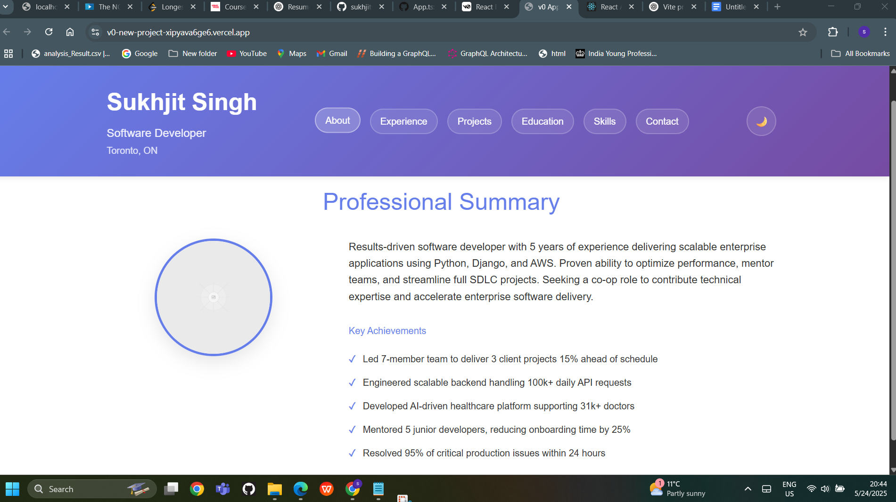
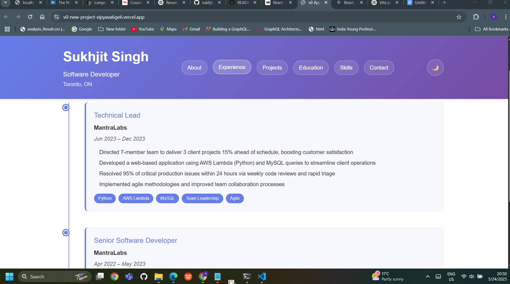
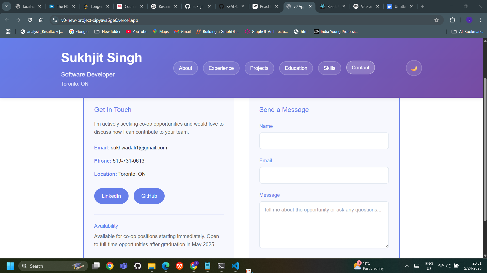
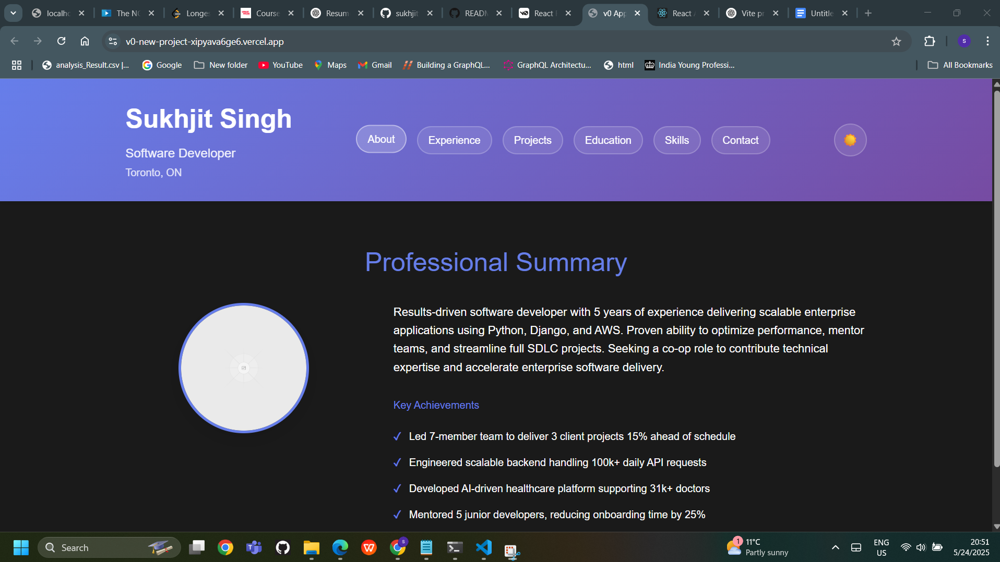

# Sukhjit Singh - React Resume Website

A modern, responsive resume website built with React and TypeScript, showcasing professional experience, skills, and projects with an interactive single-page application design.

##  Features Implemented

###  Technical Requirements Met
- **React App Structure**: Built using Create React App with TypeScript
- **Component Architecture**: 7 reusable components (Header, About, Experience, Projects, Education, Skills, Contact)
- **Organized Structure**: Components cleanly organized in individual folders
- **Props Implementation**: Data passed between components using props
- **State Management**: useState hooks for theme toggle, navigation, and form handling
- **Conditional Rendering**: Dynamic section switching and content visibility
- **Dynamic Lists**: .map() used for rendering experiences, projects, skills, and education
- **CSS Modules**: Individual styling files for each component (no global CSS)
- **Responsive Design**: Mobile-friendly layouts with breakpoints
- **Complete Resume Content**: Education, skills, experience, and contact information

###  Key Features
- **Dark/Light Theme Toggle**: Switch between themes with smooth transitions
- **Single Page Navigation**: Smooth section switching without page reloads
- **Interactive Projects**: Toggle between featured and all projects
- **Contact Form**: Functional contact form with validation and success messages
- **Professional Timeline**: Visual timeline for work experience
- **Skill Categories**: Organized skill display with hover effects
- **Responsive Grid Layouts**: Adaptive layouts for all screen sizes
- **Modern UI/UX**: Gradient backgrounds, hover animations, and clean design

### Installation Steps

#### Option 1: Clone from GitHub
\`\`\`bash
# Clone the repository
git clone https://github.com/sukhjitwadali/React-Resume-Website-.git

# Navigate to project directory
cd React-Resume-Website-

# Install dependencies
pnpm install

# Start the development server
pnpm start
\`\`\`

#### Option 2: Manual Setup
1. **Create React App**
   \`\`\`bash
   npx create-react-app sukhjit-resume --template typescript
   cd sukhjit-resume
   \`\`\`

2. **Create Folder Structure**
   \`\`\`bash
   mkdir src/components
   mkdir src/components/Header
   mkdir src/components/About
   mkdir src/components/Experience
   mkdir src/components/Projects
   mkdir src/components/Education
   mkdir src/components/Skills
   mkdir src/components/Contact
   \`\`\`

3. **Copy Files**
   - Copy all component files from this repository
   - Replace default App.tsx and App.module.css
   - Update index.tsx and public/index.html

4. **Install Dependencies**
   \`\`\`bash
   pnpm install
   \`\`\`

##  How to Run the Project

### Development Mode
\`\`\`bash
# Start the development server
pnpm start
\`\`\`
- Opens automatically in browser at `http://localhost:3000`
- Hot reload enabled - changes reflect immediately
- Development tools and error reporting available

### Production Build
\`\`\`bash
# Create optimized production build
pnpm run build

# Serve the build locally (optional)
pnpm serve -s build
\`\`\`

### Testing
\`\`\`bash
# Run tests
pnpm test

# Run tests with coverage
pnpm test -- --coverage
\`\`\`

# Screenshot of site

